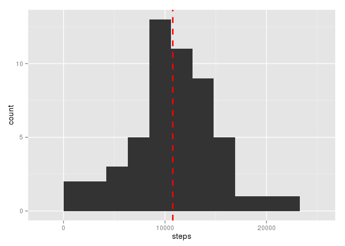
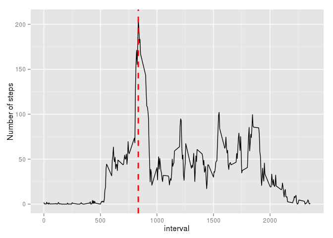
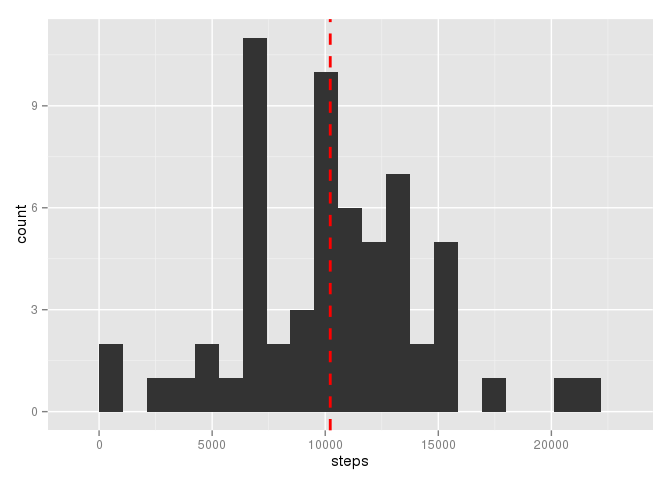
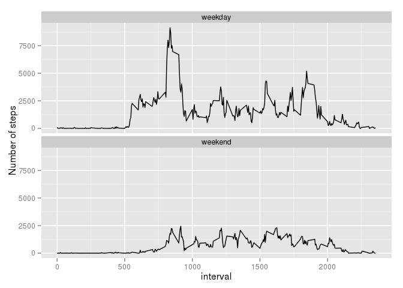

# Reproducible Research: Peer Assessment 1


## Loading and preprocessing the data

```r
#load libraries
library(ggplot2);library(plyr);

#options
options(scipen=1, digits=2)

#load data
data = read.csv("activity.csv")

#remove NA steps
dataWithoutNA = subset(data, !is.na(steps))
```
## What is mean total number of steps taken per day?
First let's prepare our data:

```r
stepsPerDay = tapply(dataWithoutNA$steps , dataWithoutNA$date, FUN=sum)
stepsPerDay = stepsPerDay[!is.na(stepsPerDay)]
stepsPerDay = as.data.frame(stepsPerDay)
stepsPerDay = cbind(stepsPerDay, rownames(stepsPerDay))
colnames(stepsPerDay) = c('steps', 'date')
```

Now, let's plot a histogram.

```r
binwidth = (range(stepsPerDay$steps)[2] - range(stepsPerDay$steps)[1])/10
ggplot(data=stepsPerDay, aes(steps)) + geom_histogram(binwidth=binwidth) + geom_vline(aes(xintercept=mean(steps)), color="red", linetype="dashed", size=1)
```

\

Let's calculate the mean and the median

```r
meanStepsPerDay = mean(stepsPerDay$steps)
medianStepsPerDay = median(stepsPerDay$steps)
```

The mean is 10766.19 and the median is 10765.

## What is the average daily activity pattern?

Let's prepare the data to plot the daily activity

```r
stepsPerInterval = tapply(dataWithoutNA$steps , dataWithoutNA$interval, FUN=mean)
stepsPerInterval = as.data.frame(stepsPerInterval)
stepsPerInterval = cbind(stepsPerInterval, as.numeric(rownames(stepsPerInterval)))
colnames(stepsPerInterval) = c('steps', 'interval')
```

Let's plot the time series plot of the 5-minute interval (x-axis) and the average number of steps taken, averaged across all days

```r
intervalWithMax=stepsPerInterval[which.max(stepsPerInterval$steps),2]
maxSteps = max(stepsPerInterval$steps)
ggplot(data=stepsPerInterval, aes(x=interval, y=steps)) +  geom_line() + ylab("Number of steps") + geom_vline(aes(xintercept=intervalWithMax), color="red", linetype="dashed", size=1)
```

\

The interval **835** contains the maximum number of steps, which is **206.17**. 

## Imputing missing values

First of all, let sum the number of missing values in the dataset

```r
missingSteps = sum(is.na(data$steps))
```
We have **2304** missing values.

Our strategy for filling in all of the missing values in the dataset is:
  
  * Find the rows with missing steps
  * If we have an average value for the interval across all days, we use this mean value
  * If there is no average for the interval, we use zero
  
Here's the code that replaces the missing values.

```r
replaceNa = function(row) {
  if(is.na(row[1])) {
    meanInterval = stepsPerInterval[row[3],1]
    meanInterval = if(is.na(meanInterval)) 0 else meanInterval
    as.numeric(meanInterval)
  } else {
    as.numeric(row[1])
  }
}

dataWithReplacedNA = data
dataWithReplacedNA$steps = apply(data,1,replaceNa)
dataWithReplacedNA$oldSteps = data$steps
```

Histogram of the total number of steps taken each day

```r
stepsPerDayReplacedNA = tapply(dataWithReplacedNA$steps , dataWithReplacedNA$date, FUN=sum)
stepsPerDayReplacedNA = as.data.frame(stepsPerDayReplacedNA)
stepsPerDayReplacedNA = cbind(stepsPerDayReplacedNA, rownames(stepsPerDayReplacedNA))
colnames(stepsPerDayReplacedNA) = c('steps', 'date')
binwidth = (range(stepsPerDayReplacedNA$steps)[2] - range(stepsPerDayReplacedNA$steps)[1])/20
ggplot(data=stepsPerDayReplacedNA, aes(steps)) + geom_histogram(binwidth=binwidth) + geom_vline(aes(xintercept=mean(steps)), color="red", linetype="dashed", size=1)
```

\

Now, let's compare the mean and the median of the dataset with replaced missing values

```r
meanWithReplacedNa = mean(stepsPerDayReplacedNA$steps)
medianWithReplacedNa = median(stepsPerDayReplacedNA$steps)
```

The mean now is **10221.93**, it used to be **10766.19** with the dataset without missing values. The new median is now  **10395**, it used to be **10765** with the dataset without missing values.

## Are there differences in activity patterns between weekdays and weekends?

First, let's prepare our dataset with a new column called dayType, which might be weekend or weekday.

```r
dataWithReplacedNA$weekday = weekdays(as.Date(as.character(dataWithReplacedNA$date))) 
dayType = function(weekday) {
  if(weekday %in% c('Sunday', 'Saturday')) {
    'weekend'
  } else {
    'weekday'
  }
}
dataWithReplacedNA$dayType = apply(dataWithReplacedNA,1, function(row) {dayType(row['weekday'])})
```


Now, let's plot a time series plot comparing weekend with weekdays. 

```r
stepsPerIntervalAndDayType = ddply(dataWithReplacedNA, .(interval, dayType), summarize, steps=sum(steps))
ggplot(data=stepsPerIntervalAndDayType, aes(x=interval, y=steps)) + ylab("Number of steps") +  geom_line() + facet_wrap(~ dayType, ncol=1)
```

\

